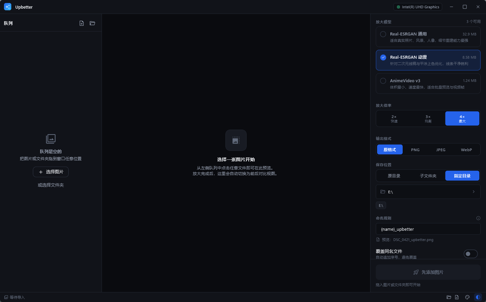
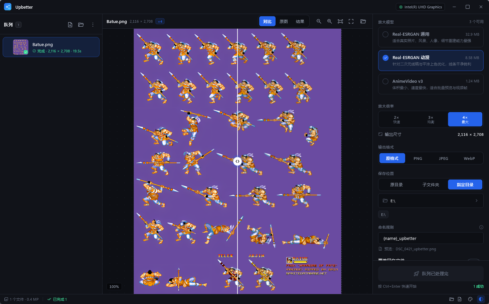

# Upbetter

[](LICENSE)
[](#system-requirements)
[](https://flutter.dev)
[](https://github.com/xinntao/Real-ESRGAN)

[简体中文](README_CN.md) · **English**

> A blazing-fast AI image upscaler for the desktop — an open-source alternative to [Upscayl](https://github.com/upscayl/upscayl)

  

  

Built with Flutter 3.47, powered by Real-ESRGAN running on ncnn + Vulkan.
Upscales 2×/3×/4× entirely on your local GPU. **Your images never leave your machine** —
after the one-time engine install, everything works fully offline.

---

## Table of Contents

- [Features](#features)
- [Performance Design](#performance-design)
- [System Requirements](#system-requirements)
- [Build & Run](#build--run)
- [Usage Walkthrough](#usage-walkthrough)
- [Keyboard Shortcuts](#keyboard-shortcuts)
- [Command Line](#command-line)
- [Project Layout](#project-layout)
- [Testing](#testing)
- [Recent Optimizations](#recent-optimizations)
- [FAQ](#faq)
- [Known Limitations](#known-limitations)
- [Contributing](#contributing)
- [License](#license)

---

## Features

| Feature | Description |
| --- | --- |
| GPU-accelerated inference | Real-ESRGAN on ncnn + Vulkan, orders of magnitude faster than CPU |
| Batch queue | Drop a whole folder and let it queue up; drag to reorder processing |
| Before/after comparison | Draggable split slider comparing "AI upscale" against "plain interpolation" |
| Three bundled models | Photo / Anime / Ultra-fast |
| Custom models | Drop community models (`.param` + `.bin`) into the model folder and they're picked up automatically |
| Naming templates | Template-driven output filenames like `{name}_{scale}`, with live preview |
| Fully offline | Zero network requests during inference; nothing is uploaded |
| Portable mode | Ship the app as a folder by placing `runtime/` next to the executable |

## Performance Design

This section explains why it's faster than the naive "one process per image" approach.

### 1. Batch merging: the model is loaded once

The inference engine reloads its weights and uploads them to VRAM on every cold start.
Measured on an Intel UHD iGPU with the x4plus model:

| Scenario | Time |
| --- | --- |
| Single image (including cold start) | 9.9 s |
| 4 images in one batch | 33.6 s |
| → derived fixed overhead | **≈ 2 s per process** |
| → derived marginal cost per image | ≈ 7.9 s |

So the engine merges tasks with **identical execution parameters** into a single process
invocation and runs them in directory mode. For N images, model loading drops from N times
to "number of batches" times.

Inputs are staged using **NTFS hard links** (via an FFI call to `CreateHardLinkW`):
zero-copy and zero extra disk usage even for 100 MB images. It automatically falls back to
copying when hard links aren't available (e.g. across volumes).

> Real log output (the app's logs and UI are written in Chinese):
>
```bash
> 批次 batch_1789679122175673：2 个文件（硬链接 2 个）
> 启动推理：realesrgan-ncnn-vulkan.exe -i .../in -o .../out -n realesrgan-x4plus -s 4 -f jpg -v
> 批次 batch_1789679122175673 完成，已写出 2 个文件
```

> Two files → one process invocation.

### 2. Progress doesn't depend on the engine

Measurements showed that in `-t 0` (auto tile) mode the engine **prints almost no progress
lines** — it only reports at tile boundaries, and auto tiling usually covers the whole image
in one tile.

```bash
-t 64 (explicit tile): 196 progress steps
-t 0  (auto)         : 0
```

Auto tiling lets the engine pick the largest tile that fits in VRAM, which is the fastest
option. So we **keep auto tiling** and instead interpolate progress client-side from measured
throughput, clamped by the real reported values as a lower bound. The bar always advances
smoothly, and never shows the "jumps to 90% then stalls" artifact.

Throughput is recorded per "model + scale + GPU" and persisted across sessions, so the second
launch gives an accurate time estimate within seconds.

### 3. Tiered decode for previews

Opening an 8000×6000 photo at full size allocates nearly 200 MB; after 4× upscaling it's
32000×24000, far beyond the GPU texture limit.

The preview uses two tiers:

1. Decode a preview capped at 2048 px on the long edge via `ImmutableBuffer.fromFilePath` — instant.
2. Only when the user zooms close to 1:1 (where quality differences become visible) does it
   decode the high-resolution version in the background and swap it in seamlessly.

Queue thumbnails work the same way: `cacheWidth` makes the **decoder** downscale to 92 px
during decoding, instead of decoding a full-size bitmap and then scaling it.

### 4. Row-level rebuilds

Rather than pulling in a state management framework, rebuild scope is organized with
`ValueNotifier` / `ListenableBuilder`: each task's progress is its own notifier, so one
task's progress tick rebuilds just that row, never the whole list.

### 5. Queue order is processing order

Batch grouping is global, so "pick the batch containing the head of the queue" and "pick the
largest batch" produce exactly the same number of batches (identical model-load count) — but
the former respects the user's ordering. The abort signal uses an incrementing generation
counter (`_abortGeneration`) rather than a boolean flag, so stop signals can't be missed when
concurrency > 1 or in the gap between batches.

---

## System Requirements

| Item | Requirement |
| --- | --- |
| OS | Windows 10 1809+ / Windows 11 |
| GPU | Any Vulkan-capable GPU (integrated or discrete: Intel / AMD / NVIDIA) |
| Runtime | [Visual C++ 2015-2022 Redistributable](https://aka.ms/vs/17/release/vc_redist.x64.exe) (usually already present) |
| Build | Flutter 3.47+, Visual Studio 2022/2026 Build Tools with "Desktop development with C++" |

> It works without a discrete GPU, but will be noticeably slower. The title bar shows the
> detected Vulkan device.

---

## Build & Run

```bash
# 1. Fetch dependencies
flutter pub get

# 2. Run in development mode
flutter run -d windows

# 3. Release build (output in build\windows\x64\runner\Release\)
flutter build windows --release
```

On first launch the app downloads the inference engine (~43 MB from the official
Real-ESRGAN release), verifies its SHA-256, and extracts it.

### Development helper scripts

```bash
# Pre-download the engine into .devtools/runtime for offline dev and integration tests
dart run tool/fetch_runtime.dart

# Verify image header parsing
dart run tool/probe_check.dart <image paths...>
```

---

## Usage Walkthrough

### 1. First launch: install the inference engine

1. Start `upbetter.exe`. You'll see the welcome screen.
2. Click **"下载并安装引擎"** (Download and install engine). The progress bar shows the
   download percentage, bytes transferred, and current speed.
   - It tries GitHub directly first, then falls back to bundled mirrors. Each source gets two
     attempts with HTTP range resume support.
   - Every source must pass SHA-256 verification, so even a compromised mirror cannot make the
     app install a tampered engine.
3. Weights are extracted automatically and you land in the main workspace.

**If the download fails**, the error screen offers three ways out:

| Option | Action |
| --- | --- |
| Use a proxy | Set `HTTP_PROXY` / `HTTPS_PROXY`, then click Retry |
| Custom mirror | Enter a trusted download URL (e.g. an internal mirror) and click Retry |
| Existing engine | Click "已有引擎？手动指定目录" and pick a folder containing `realesrgan-ncnn-vulkan.exe` |

> You can also name an engine folder `runtime/` and place it next to the executable — the app
> prefers it automatically (portable mode).

---

### 2. Import images

Any of three ways:

| Method | Action |
| --- | --- |
| Drag & drop | Drop files or an **entire folder** anywhere in the window; release when the overlay appears |
| Buttons | The **"+"** button in the queue panel header adds files; the folder icon adds a directory |
| Empty state | "选择图片 / 或选择文件夹" in the middle of an empty queue |

- Supported formats: PNG / JPEG / WebP / BMP / GIF / TGA / PPM / PGM
- Dropping a folder collects images **recursively**
- Image info is read concurrently (16-way) from file headers only, no decoding — hundreds of
  files take an instant
- Unreadable files are skipped, and the toast tells you how many were skipped

---

### 3. Choose a model

Click a card in the "放大模型" (Model) section at the top of the right panel:

| Model | Size | Best for |
| --- | --- | --- |
| **Real-ESRGAN 通用** (General) | 32.9 MB | Real photos, landscapes, portraits — strongest detail reconstruction |
| **Real-ESRGAN 动漫** (Anime) | 8.6 MB | Anime line art and flat shading — clean, crisp edges |
| **AnimeVideo v3** | 1.2 MB | Smallest and fastest; good for batch previews and video frames |

**Using custom models**: drop a community model's `.param` and `.bin` files into the model
folder (`%APPDATA%\Upbetter\models`) and restart. The `.param` filename without
its extension is the model name.

---

### 4. Choose a scale factor

Pick **2× / 3× / 4×** in the "放大倍率" (Scale) section:

- **4× is the models' native scale** and gives the best quality.
- At scales below native, the engine runs native-scale inference and then downsamples. Quality
  is still clearly better than plain interpolation, and the UI tells you explicitly when you're
  off the native scale.
- Selecting a queue item shows its **output dimensions** live below.

---

### 5. Configure output

#### **Format**

| Option | Notes |
| --- | --- |
| 原格式 (Original) | Keeps the input format (JPEG in → JPEG out) |
| PNG | Lossless, large files |
| JPEG | Lossy, small files |
| WebP | Modern format balancing size and quality |

#### **Location**

| Option | Notes |
| --- | --- |
| 原目录 (Alongside) | Next to the source file |
| 子文件夹 (Subfolder) | Creates a named subfolder under the source directory |
| 指定目录 (Custom) | Writes to a fixed folder; recently used folders are listed for one-click switching |

#### **Naming**

Supported placeholders, with a live preview under the input:

| Placeholder | Meaning | Example |
| --- | --- | --- |
| `{name}` | Source filename without extension | `DSC_0421` |
| `{scale}` | Scale factor | `4x` |
| `{model}` | Model name | `realesrgan-x4plus` |
| `{date}` | Date | `20260918` |
| `{time}` | Time | `143052` |
| `{w}` / `{h}` | Output width / height | `1600` |

The default template is `{name}_upbetter`, producing `DSC_0421_upbetter.png`.

#### **Overwrite existing files**

- Off (default): appends `(1)`, `(2)`, … — never overwrites
- On: replaces files with the same name

---

### 6. Start processing

1. Click **"开始放大 · N 个文件"** in the bottom-right (or press `Ctrl+Enter`).
   Above the button you'll see an **estimated time** based on historical measurements. On the
   first run with a given configuration it honestly says "首次运行后可知" (unknown until first
   run) instead of showing a number that could be off by 10×.
2. While running you can watch:
   - Title bar: activity indicator with the current filename
   - Queue rows: independent progress bar and percentage per file
   - Right panel: overall progress, live throughput (MP/s), time remaining
   - Status bar: throughput, completed count

#### **Stop vs. cancel**

| Action | Effect |
| --- | --- |
| "停止" button / `Esc` | Aborts the current batch; **unprocessed tasks return to the queue**, so pressing start again resumes |
| ⓧ on a queue row (on hover) | Cancels just that task (marked "已取消", produces no file) |
| Right-click → remove | Removes the task from the queue entirely |

> Completed tasks always keep their results — stopping never throws away finished work.

---

### 7. Compare results

When processing completes, the preview area switches to the **comparison view** automatically:

| Mode | Description |
| --- | --- |
| **对比** (Compare) | Left of the divider is the original (plain interpolation), right is the AI result; drag the divider to inspect differences |
| **原图** (Original) | Original only |
| **结果** (Result) | Upscaled result only |

#### **Canvas controls**

| Action | Effect |
| --- | --- |
| Mouse wheel | Zoom anchored at the cursor |
| Drag | Pan |
| Double-click | Toggle between "fit to window" and "actual pixels (1:1)" |
| Hold `Space` | Temporarily show the original; release to restore (the most natural comparison gesture in photo tools) |

The toolbar additionally offers **zoom out / zoom in / fit / 1:1** buttons and a shortcut to
reveal the result file in Explorer.

> "Fit to window" never magnifies beyond 100% — this tool exists to judge image quality, and
> stretching a small image to fill the window would only show you interpolated fake detail.

---

### 8. Advanced options (optional)

Expand "高级选项" (Advanced) at the bottom of the right panel:

| Option | Notes |
| --- | --- |
| **计算设备** (Device) | Pick which GPU on multi-GPU systems; click "检测 GPU" if none was detected |
| **显存分块** (VRAM tile) | Default "自动" lets the engine pick the largest tile that fits VRAM (fastest). Lower it if you hit out-of-memory |
| **TTA 增强模式** | 8× the compute for a negligible quality gain; off by default |
| **并行任务数** (Concurrency) | Default 1. Parallelism on a single GPU gives limited gains but multiplies VRAM usage; only worth raising for queues with mixed parameters |
| **处理时阻止休眠** | Prevents the system from sleeping during long batches |
| **完成后提示音** | Plays a sound when files finish successfully |
| **完成后打开输出目录** | Opens the output folder in Explorer when done |

---

### 9. Batch processing tips

1. **Set parameters before dropping files** — they apply to all pending tasks; finished ones
   keep what they used.
2. **Files with identical parameters are merged into one inference run** — for maximum
   throughput, use the same model and scale across a batch.
3. **Reorder by dragging** — a drag handle appears on the left of a row on hover; processing
   strictly follows queue order.
4. **Changed your mind mid-run** — just change the parameters; all not-yet-started tasks pick
   up the new values immediately.
5. **Retrying** — the "⋮" menu in the queue header has "重试失败项", which re-queues only failed
   and cancelled tasks.

---

### 10. Personalization

On the right side of the status bar:

| Button | Function |
| --- | --- |
| Palette | Pick an accent color (6 presets; the global primary and gradients follow along) |
| Contrast / sun / moon | Cycles System → Dark → Light |
| Document icon | Opens the run log — the first place to look when something fails |

Window position, size, and maximized state are saved on exit and restored next launch.

---

## Keyboard Shortcuts

| Shortcut | Action |
| --- | --- |
| `Ctrl` + `O` | Add files |
| `Ctrl` + `Shift` + `O` | Add a folder |
| `Ctrl` + `Enter` | Start / stop processing |
| `Esc` | Stop processing; when idle, clear the current selection |
| `Delete` | Remove the selected task from the queue |
| `Space` (hold) | Temporarily show the original in the preview |
| Double-click canvas | Toggle fit ⇄ 1:1 |

---

## Command Line

Works with Windows "Open with" and scripts:

```bash
# Import files/folders and launch the UI
upbetter.exe "D:\photos\a.jpg" "D:\photos\b.png"

# Explicit, repeatable
upbetter.exe --add "D:\photos" --add "E:\shot.png"

# Import and start processing immediately (automation)
upbetter.exe --add "D:\photos" --run
```

| Argument | Meaning |
| --- | --- |
| `<path>` | Positional; a file or folder to import |
| `--add` / `-a` `<path>` | Same, explicit form; repeatable |
| `--run` / `-r` | Start processing immediately after import |

---

## Project Layout

```bash
lib/
├── main.dart                        Entry point: paths, window creation, CLI args
└── src/
    ├── core/                        UI-independent core
    │   ├── app_paths.dart           Directory layout (portable mode support)
    │   ├── models.dart              Domain models: model catalog, options, jobs
    │   ├── settings.dart            Persisted settings (debounced writes)
    │   ├── engine/
    │   │   ├── upscale_engine.dart  Scheduler: batching, process driving, progress, cancel
    │   │   └── output_path.dart     Naming templates and output path resolution
    │   ├── image/
    │   │   ├── image_probe.dart     Dimension probing from file headers only
    │   │   └── image_decode.dart    Capped decode (max long edge) for previews
    │   ├── runtime/
    │   │   ├── runtime_manager.dart Engine install, model discovery, GPU enumeration
    │   │   └── downloader.dart      Resumable download + SHA-256 verification
    │   └── util/                    Logging, formatting, hard links, power, notifications
    └── ui/
        ├── app.dart                 AppScope injection and theme assembly
        ├── theme/                   Design tokens and Material 3 theme
        ├── shell/title_bar.dart     Custom-drawn title bar
        ├── pages/                   Install wizard, main workspace
        ├── panels/                  Queue / preview / compare canvas / settings / status bar / logs
        ├── widgets/primitives.dart  Base component library
        └── util/                    File dialogs, shell integration

assets/
├── icon.png                         App icon source (1254×1254; input to the icon generator)
└── icon_256.png                     256px copy used for in-app branding

tool/                                Development helper scripts (not shipped)
├── generate_icon.dart               Builds the multi-size app_icon.ico from assets/icon.png
├── fetch_runtime.dart               Pre-downloads the engine for offline dev and integration tests
├── probe_check.dart                 Verifies image header parsing
├── capture_window.ps1               Captures the app window for UI review
└── extract_exe_icon.ps1             Pulls the icon back out of the exe to verify it was embedded

test/                                Unit tests + end-to-end tests that really drive the engine
```

### Data directories

```bash
%APPDATA%\Upbetter\
├── runtime\        Inference engine executable and its DLLs
├── models\         Model weights (drop custom models here)
├── cache\          Download cache and batch staging (auto-cleaned)
├── logs\           Run logs
└── settings.json   Settings, window state, measured throughput
```

### Application icon

The icon follows the native Windows path, ending up compiled into the executable by the
resource compiler:

```bash
assets/icon.png
  └─ dart run tool/generate_icon.dart
       └─ windows/runner/resources/app_icon.ico   (16/24/32/48/64/128/256)
            └─ windows/runner/Runner.rc           (IDI_APP_ICON)
                 └─ upbetter.exe                  (taskbar, title bar, Explorer)
```

To change the icon, replace `assets/icon.png` and run:

```bash
dart run tool/generate_icon.dart     # regenerate the ICO
flutter build windows --release      # recompile it into the exe
```

> Why not `flutter_launcher_icons`: for Windows it only produces a **single-size** ICO
> (one 256×256 entry), leaving Windows to downscale 256px to 16/24/32px — which blurs icons
> with fine lines or text. The ICO format supports packing multiple images into one file, so
> this project generates the full set and lets Windows pick a native resolution for every
> display context. See the comments in `tool/generate_icon.dart`.

### Key design conventions

- **`core/` must not depend on `ui/`** — the core is testable without a Flutter UI.
- **Options are snapshotted per job** — finished jobs keep the parameters they ran with;
  changing options in the UI only propagates to jobs that haven't started.
- **Aborts use a generation counter, not a boolean** — `_abortGeneration` increments, so stop
  signals can't be missed with concurrency > 1 or in the gap between batches.

---

## Testing

```bash
# Everything
flutter test

# Static analysis
flutter analyze

# Queue orchestration only (fast, no engine needed)
flutter test test/engine_queue_test.dart

# End-to-end tests that really drive the inference engine (needs .devtools/runtime)
flutter test test/engine_integration_test.dart

# Network tests: download and install the engine (~43 MB)
UPBETTER_NETWORK_TESTS=1 flutter test test/runtime_install_test.dart
```

| File | Coverage |
| --- | --- |
| `widget_test.dart` | Image header parsing (PNG/JPEG), GPU device line parsing, naming templates, formatting, options serialization |
| `engine_queue_test.dart` | Enqueue dedup, drag reordering, cancel semantics, option propagation (full-field), retry re-queue, result detection (`hasResult`), cleanup, time estimation |
| `engine_integration_test.dart` | **Really invokes the engine**: output dimensions, batch merging (3 files → 1 process), processing order, cancellation, staging cleanup |
| `runtime_install_test.dart` | Archive extraction filtering, engine discovery, model integrity, SHA-256, real download & install |

---

## Recent Optimizations

A focused refactoring pass shipped in the current version round — no behavior change
outside the list below, verified by a clean `flutter analyze` and a green `flutter test`.

**Correctness fixes**

- **Full-field option comparison.** `applyOptionsToPending` used to compare only a subset of
  fields, so changing the subfolder name or the overwrite flag didn't propagate to pending
  jobs. `UpscaleOptions` now has `sameAs` (see `models.dart`) that compares **every** field,
  and the output settings panel uses it.
- **Output-settings sync.** The subfolder text field now stays in sync when the setting is
  reset externally; the naming preview reuses the same `OutputResolver.renderTemplateString`
  the real resolver uses.
- **Preview toolbar staleness.** The toolbar now subscribes to the job's `status` and
  `outputPath` via a merged `ListenableBuilder`, so it reflects completion the instant a job
  finishes instead of one frame late. A dead `_effectiveMode` branch was removed.
- **GPU probe races.** `detectGpus` now reuses an in-flight probe future instead of launching
  overlapping probes if the user clicks fast.

**Deduplication**

- `UpscaleJob.hasResult` replaces three near-identical `_hasResult` helpers.
- GPU device-line parsing uses one regex (`RuntimeManager.gpuDeviceLinePattern`) shared by the
  engine and the UI instead of two copies.
- `decodeImageCapped` moved into `core/image/image_decode.dart` and is shared by the compare
  canvas instead of being duplicated.
- Failed-job retry now lives on the engine (`retryJob`); the queue panel doesn't re-implement
  it.
- Engine-directory picking is shared via `FileDialogs.pickEngineDirectory`; status-bar path
  joining uses `package:path`'s `join` rather than hand-rolled concatenation.

**Cleanup**

- Removed leftover debug files and the unused `AppPaths.windowStateFile`.
- `SegmentedControl` no longer builds duplicate rows when collapsed.
- Added six regression tests in `engine_queue_test.dart` covering option equivalence,
  subfolder/overwrite propagation, `hasResult`, and retry semantics.

---

## FAQ

**"No GPU detected" — what now?**
Make sure your GPU driver is installed (the Vulkan runtime ships with it). You can also expand
"高级选项" and click "检测 GPU" to re-probe. Even without a Vulkan device the engine falls back
to CPU inference, just much slower.

**The engine download keeps failing.**
Usually the network can't reach GitHub. Three fixes: set a system proxy and retry; enter a
trusted mirror on the error screen; or obtain an engine folder elsewhere and use
"已有引擎？手动指定目录".

**Out of VRAM on large images?**
Expand "高级选项" and lower "显存分块" from "自动" (try 256, then 128/64). Smaller tiles use less
VRAM but run slower.

**Why are output files so much larger than the input?**
PNG is lossless. Switch "输出格式" to JPEG or WebP to control size.

**Is EXIF preserved?**
Not currently — outputs carry no original EXIF. This is a known limitation.

**What if I open two windows?**
There's no single-instance mutex yet, so they run independently. Avoid processing the same
files from both.

**Can I use my own models?**
Drop the `.param` and `.bin` into the model folder and restart. The `.param` filename without
its extension is the name passed to the engine.

---

## Known Limitations

- No single-instance mutex; launching twice opens multiple windows
- Outputs don't preserve EXIF / ICC color profiles
- Windows desktop only (the core is cross-platform, but windowing and file-association logic
  is Windows-specific)
- No video frame-by-frame processing
- Concurrency > 1 doesn't speed up a single image; it only helps queues with mixed parameters

---

## Contributing

Issues and pull requests are welcome.

### Development workflow

```bash
flutter pub get
dart run tool/fetch_runtime.dart     # fetch the engine; integration tests need it
flutter analyze                      # must be clean before submitting
flutter test                         # must be green before submitting
```

### Pre-submit checklist

- [ ] `flutter analyze` reports no errors / warnings / infos
- [ ] `flutter test` passes (network tests may be skipped)
- [ ] New core logic comes with tests; changes to the inference path get end-to-end coverage
- [ ] UI changes verified with a screenshot via `tool/capture_window.ps1`

### Conventions

- **`lib/src/core/` must not import `lib/src/ui/`** — the core must stay testable headlessly
- Comments explain **why**, not what the code already says
- New user-facing behavior gets documented in the walkthrough above
- UI copy and code comments are written in Chinese

### Commit messages

Use `type: summary`, with `feat` / `fix` / `perf` / `refactor` / `docs` / `test` / `chore`.

---

## License

Released under the **MIT License** — see [LICENSE](LICENSE).

```bash
Copyright (c) 2026 Upbetter contributors
```

### Third-party components

This project depends on and distributes third-party components under their own licenses:

| Component | License |
| --- | --- |
| [Real-ESRGAN](https://github.com/xinntao/Real-ESRGAN) (model weights and inference engine) | BSD 3-Clause |
| [ncnn](https://github.com/Tencent/ncnn) | BSD 3-Clause |
| [window_manager](https://pub.dev/packages/window_manager), [archive](https://pub.dev/packages/archive) | MIT |
| [desktop_drop](https://pub.dev/packages/desktop_drop), [material_symbols_icons](https://pub.dev/packages/material_symbols_icons) | Apache 2.0 |
| [file_selector](https://pub.dev/packages/file_selector), [path_provider](https://pub.dev/packages/path_provider), [path](https://pub.dev/packages/path), [crypto](https://pub.dev/packages/crypto), [ffi](https://pub.dev/packages/ffi) | BSD 3-Clause |

Full copyright notices and license texts: [THIRD_PARTY_NOTICES.md](THIRD_PARTY_NOTICES.md).

> Note: on first launch the app downloads the inference engine and model weights from the
> official Real-ESRGAN release. Those files are likewise BSD 3-Clause licensed and remain the
> property of their original authors.

---

## Tech Stack & Credits

- [Flutter](https://flutter.dev/) 3.47 · Dart 3.13
- [Real-ESRGAN](https://github.com/xinntao/Real-ESRGAN) — super-resolution models and the ncnn Vulkan inference engine
- [window_manager](https://pub.dev/packages/window_manager) · [desktop_drop](https://pub.dev/packages/desktop_drop) · [file_selector](https://pub.dev/packages/file_selector) · [archive](https://pub.dev/packages/archive) · [material_symbols_icons](https://pub.dev/packages/material_symbols_icons)
- The UI takes product-shape inspiration from [Upscayl](https://github.com/upscayl/upscayl)

The engine release is pinned to `v0.2.5.0 (20220424)`, SHA-256:
`abc02804e17982a3be33675e4d471e91ea374e65b70167abc09e31acb412802d`
